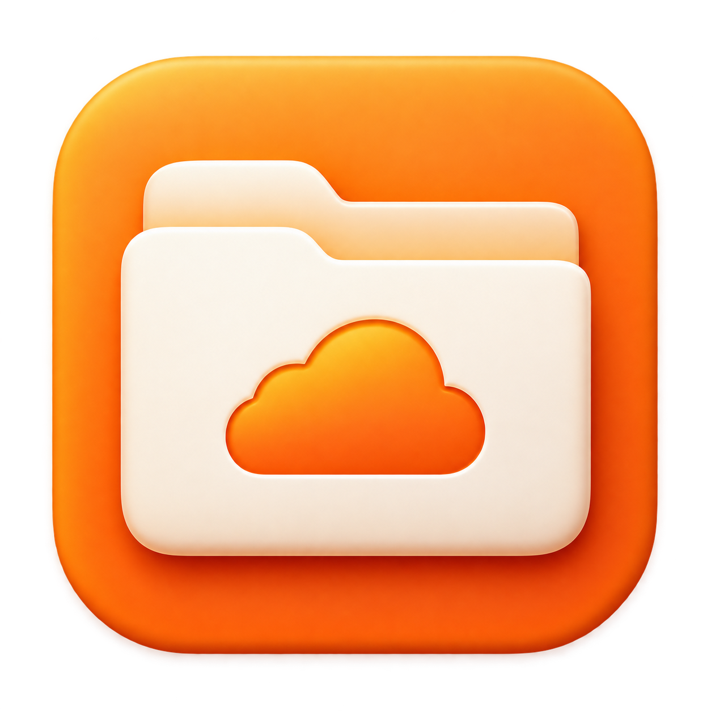
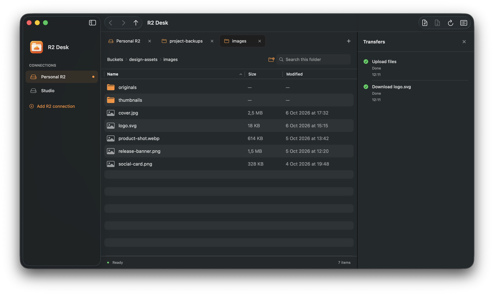

<div align="center">
  
  <h1>R2 Desk</h1>
  <p>A native macOS file browser for Cloudflare R2.</p>
  <p>
    <a href="https://github.com/BUSHA/r2desk/actions/workflows/ci.yml"></a>
    
    <a href="LICENSE"></a>
  </p>
</div>



## Features

- Browse buckets across multiple R2 connections.
- Open folders in tabs and restore them after restart.
- Upload and download files and folders, with drag and drop for uploads.
- Create folders, rename files, and delete items.
- Preview files with Quick Look.
- Search the current folder and sort by name, size, or modification date.
- View transfer progress and results in a resizable sidebar.
- Store access keys in macOS Keychain.

## Build and install

Requires macOS 14 or later and Apple Command Line Tools with Swift 5.9 or later.

```sh
xcode-select --install
```

```sh
git clone https://github.com/BUSHA/r2desk.git
cd r2desk
bash scripts/build-app.sh
open "dist/R2 Desk.app"
```

To install, drag `dist/R2 Desk.app` to Applications. The build script also creates
`dist/R2-Desk.zip`. Each build targets the processor of the Mac used to build it.
Builds use an ad hoc signature and are not notarized.

When a GitHub release is published, Actions builds separate Apple silicon and
Intel ZIP files. It attaches both app packages to the
release. See the [release guide](docs/RELEASING.md) for the steps.

## Connect to R2

1. [Create an R2 API token](https://developers.cloudflare.com/r2/api/tokens/) with
   **Admin Read only** access to browse and download, or **Admin Read & Write** to change files.
2. Copy the **S3 access key ID** and **secret access key**.
3. Select **Add R2 connection** in the app. Enter a connection name, your Cloudflare
   account ID, and the two keys.
4. Select the storage location and click **Connect**.
5. Double-click a bucket to open it.

Bucket listing requires admin permissions. Object-only keys cannot list buckets.
Use the S3 credentials generated for the R2 token, rather than the token value itself.

Select **Default** for standard buckets, including those with a Europe location hint.
Select **EU**, **US**, or **FedRAMP** for buckets in that jurisdiction.
Each connection uses the selected storage endpoint.

## Usage

Double-click a folder to open it or a file to preview it. Right-click a bucket or
folder to open it in a new tab. Use the path bar to return to a parent folder or the
bucket list. Right-click a connection to edit or remove it.

Drop files into the file list to upload them. Select items and click **Download**
to save them locally. The **Transfers** button toggles the right sidebar.

| Shortcut | Action |
| --- | --- |
| `⌘T` | New tab |
| `⌘W` | Close tab; the last tab stays open |
| `⇧⌘N` | Add connection |
| `⌘U` | Upload |
| `⌘D` | Download selected items |
| `⌘R` | Refresh |
| `⌘↑` | Parent folder |
| `⌘[` / `⌘]` | Back / Forward |
| `⌘Delete` | Delete selected items |
| `⌘J` | Toggle Transfers |

## Limitations

- Upload and file rename support files up to **5 GiB**. Multipart uploads and transfer resume are not supported.
- Folders can be uploaded, downloaded, created, and deleted, but not renamed.
- Quick Look downloads a temporary copy. Local edits do not sync to R2, and buckets are not mounted as disks.
- Rename copies the file, then deletes the source. The operation is not atomic.
  Avoid renaming a file while another client writes to it.
- R2 has no Trash. Deletion and file replacement require confirmation.
  Completed changes remain if an operation stops or fails.
- Folder and multiple-file downloads require a destination with no files at the same paths.
  Single-file downloads use the macOS Save dialog.
- Symbolic links inside uploaded folders are skipped. Downloads reject unsafe local paths.
- Transfer history is cleared when the app closes.

## Privacy

The app connects directly to Cloudflare R2 over HTTPS and has no analytics.
Access keys are stored in macOS Keychain. Connection settings and tab state are
stored locally in UserDefaults.

To report a security issue, see [SECURITY.md](SECURITY.md).

## Development

```sh
bash scripts/test.sh
bash scripts/build-app.sh
```

The checks use mock HTTP responses and do not require an R2 account.
Set `R2DESK_SDK_PATH` to select a specific installed macOS SDK.

See [CONTRIBUTING.md](CONTRIBUTING.md) for the code structure and contribution steps,
and [RELEASING.md](docs/RELEASING.md) for packaging and distribution.

## License

[MIT](LICENSE) © 2026 BUSHA and contributors.

This project is not affiliated with Cloudflare.
